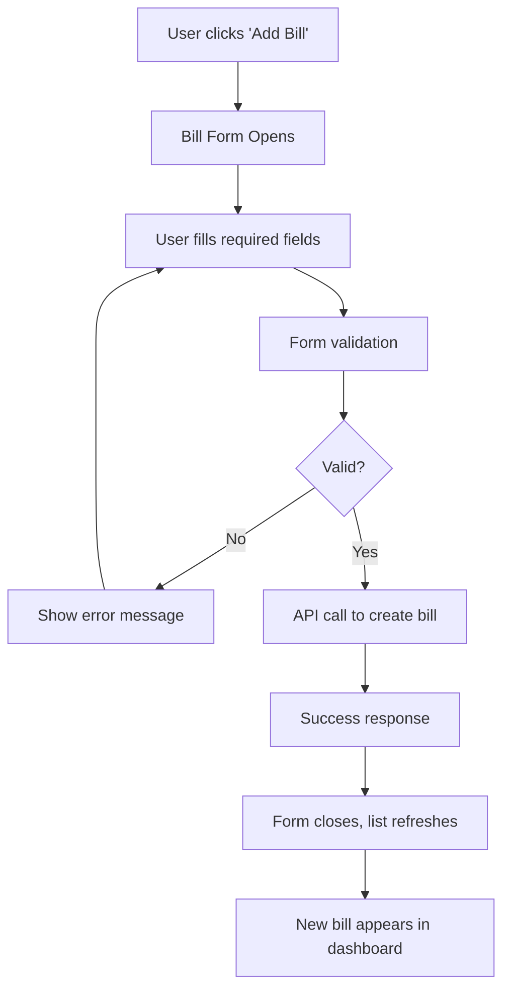
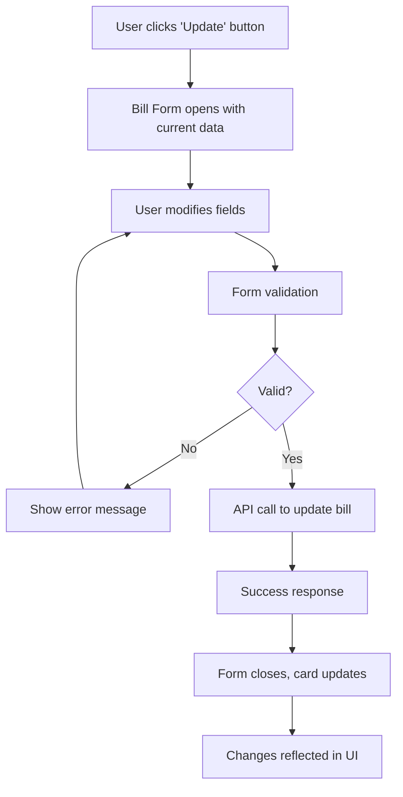
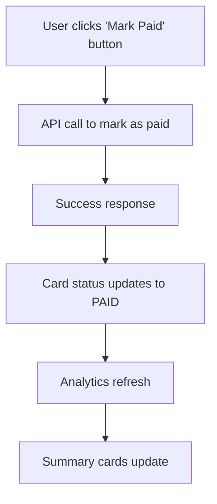
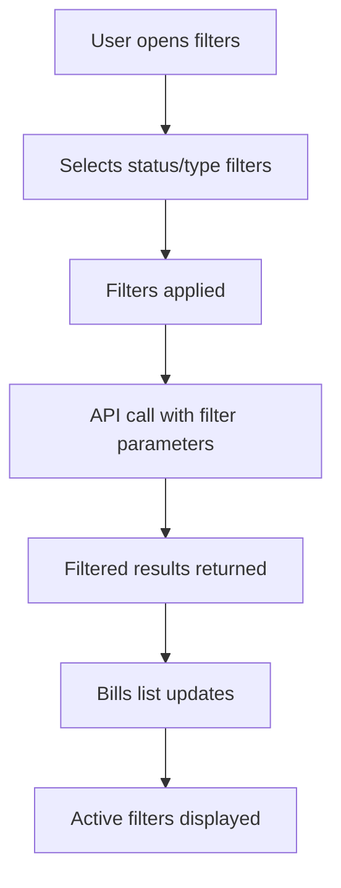

# 📋 Billing Management System Documentation

## 📖 Overview

The Billing Management System is a comprehensive solution for managing recurring bills including utilities, subscriptions, loans, and other recurring expenses. It provides users with a complete CRUD interface, analytics dashboard, and bill management features.

## 🏗️ System Architecture

### Core Components

```
src/
├── types/bill.ts                    # TypeScript interfaces and enums
├── services/
│   ├── api.ts                       # API service with bill endpoints
│   └── mockBillData.ts              # Mock data service for development
├── components/Bills/
│   ├── BillCard.tsx                 # Individual bill display component
│   └── BillForm.tsx                 # Create/Edit bill form component
└── pages/Bills.tsx                  # Main billing dashboard page
```

### System Flow Diagram

```
┌─────────────────┐    ┌──────────────────┐    ┌─────────────────┐
│   User Interface │    │   React Components │    │   API Service   │
│                 │    │                  │    │                 │
│  ┌─────────────┐│    │ ┌──────────────┐ │    │ ┌─────────────┐ │
│  │ Bills Page  ││◄──►│ │ BillCard     │ │◄──►│ │ API Methods │ │
│  └─────────────┘│    │ └──────────────┘ │    │ └─────────────┘ │
│                 │    │                  │    │                 │
│  ┌─────────────┐│    │ ┌──────────────┐ │    │ ┌─────────────┐ │
│  │ Analytics   ││◄──►│ │ BillForm     │ │◄──►│ │ Mock Data   │ │
│  └─────────────┘│    │ └──────────────┘ │    │ └─────────────┘ │
└─────────────────┘    └──────────────────┘    └─────────────────┘
         │                       │                       │
         │                       │                       │
         ▼                       ▼                       ▼
┌─────────────────┐    ┌──────────────────┐    ┌─────────────────┐
│   State Mgmt    │    │   Type Safety    │    │   Backend API   │
│                 │    │                  │    │                 │
│ • useState      │    │ • TypeScript     │    │ • REST Endpoints│
│ • useEffect     │    │ • Interfaces     │    │ • JWT Auth      │
│ • Context       │    │ • Enums          │    │ • Validation    │
└─────────────────┘    └──────────────────┘    └─────────────────┘
```

## 📊 Data Models

### Bill Interface

```typescript
interface Bill {
  id: string;                        // Unique bill identifier
  userId: string;                    // Owner of the bill
  billName: string;                  // Descriptive name (1-255 chars)
  billType: BillType;                // utility | subscription | loan | others
  amount: number;                    // Bill amount (must be > 0)
  dueDate: string;                   // ISO 8601 datetime
  frequency: BillFrequency;          // monthly | quarterly | yearly
  status: BillStatus;                // PENDING | PAID | OVERDUE
  createdAt: string;                 // Creation timestamp
  updatedAt: string;                 // Last update timestamp
  paidAt?: string;                   // Payment timestamp (optional)
  notes?: string;                    // Additional notes (max 500 chars)
  provider?: string;                 // Service provider (max 100 chars)
  referenceNumber?: string;          // Account/reference number (max 100 chars)
}
```

### Enums

```typescript
enum BillType {
  UTILITY = 'utility',              // Electricity, Water, Gas, Internet
  SUBSCRIPTION = 'subscription',    // Netflix, Spotify, Gym membership
  LOAN = 'loan',                    // Loan repayments
  OTHERS = 'others'                 // Any other recurring bills
}

enum BillStatus {
  PENDING = 'PENDING',              // Bill created, not yet paid
  PAID = 'PAID',                    // Bill has been paid
  OVERDUE = 'OVERDUE'               // Bill past due date
}

enum BillFrequency {
  MONTHLY = 'monthly',              // Monthly bills
  QUARTERLY = 'quarterly',          // Every 3 months
  YEARLY = 'yearly'                 // Annual bills
}
```

## 🎨 User Interface Components

### 1. Bills Dashboard (`/bills`)

**Location**: `src/pages/Bills.tsx`

**Features**:
- 📊 **Analytics Cards**: Display pending, paid, and overdue amounts
- 🔍 **Advanced Filtering**: Filter by status and bill type
- 📱 **Responsive Grid**: Card-based layout for all screen sizes
- 🔄 **Real-time Updates**: Automatic refresh after operations
- 📝 **Empty States**: Helpful messages when no bills exist

**Analytics Cards**:
```typescript
// Four summary cards showing:
- Total Pending Amount: $1,250.50 (8 bills)
- Total Paid Amount: $2,100.00 (15 bills)  
- Total Overdue Amount: $300.00 (2 bills)
- Total Bills: 25
```

### 2. Bill Card Component

**Location**: `src/components/Bills/BillCard.tsx`

**Visual Elements**:
- 🏷️ **Status Chips**: Color-coded indicators (PENDING=warning, PAID=success, OVERDUE=error)
- 🎨 **Type Badges**: Different colors for each bill type
- 💰 **Amount Display**: Prominent currency formatting
- 📅 **Due Date**: Formatted date with overdue highlighting
- ⚠️ **Overdue Warning**: Red alert box for overdue bills
- 🔘 **Action Buttons**: Update and Mark Paid buttons

**Overdue Detection Formula**:
```typescript
const isOverdue = (dueDate: string): boolean => {
  return new Date(dueDate) < new Date();
};

const isBillOverdue = isOverdue(bill.dueDate) && bill.status === BillStatus.PENDING;
```

**Action Buttons**:
- **Update Button**: Opens edit form (always visible)
- **Mark Paid Button**: Quick payment action (only for PENDING bills)
- **Menu Actions**: Delete and additional options via three-dot menu

### 3. Bill Form Component

**Location**: `src/components/Bills/BillForm.tsx`

**Form Fields**:
- **Bill Name** (required): 1-255 characters
- **Bill Type** (required): Dropdown selection
- **Amount** (required): Number input with validation (> 0)
- **Due Date** (required): HTML5 date picker
- **Frequency** (required): Monthly/Quarterly/Yearly
- **Status** (edit only): PENDING/PAID/OVERDUE
- **Provider** (optional): Service provider name
- **Reference Number** (optional): Account number
- **Notes** (optional): Additional information

**Validation Rules**:
```typescript
const validateForm = (): boolean => {
  if (!formData.billName.trim()) {
    setError('Bill name is required');
    return false;
  }
  if (formData.amount <= 0) {
    setError('Amount must be greater than 0');
    return false;
  }
  if (!formData.dueDate) {
    setError('Due date is required');
    return false;
  }
  return true;
};
```

## 🔌 API Integration

### API Service Methods

**Location**: `src/services/api.ts`

#### Core CRUD Operations

```typescript
// Get all bills with filtering and pagination
async getUserBills(filters?: BillFilters): Promise<PaginatedBillsResponse>

// Get specific bill
async getBill(billId: string): Promise<Bill>

// Create new bill
async createBill(billData: CreateBillRequest): Promise<Bill>

// Update existing bill
async updateBill(billId: string, updateData: UpdateBillRequest): Promise<Bill>

// Delete bill
async deleteBill(billId: string): Promise<boolean>
```

#### Bill Management

```typescript
// Mark bill as paid with optional notes
async markBillAsPaid(billId: string, notes?: string): Promise<Bill>

// Update bill status
async updateBillStatus(billId: string, status: string): Promise<boolean>
```

#### Analytics

```typescript
// Get comprehensive analytics summary
async getBillAnalyticsSummary(): Promise<BillAnalytics>

// Get total pending amount
async getTotalPendingAmount(): Promise<number>

// Get total paid amount for period
async getTotalPaidAmount(period: string): Promise<TotalPaidAnalytics>

// Get total overdue amount
async getTotalOverdueAmount(): Promise<number>

// Get overdue bills
async getOverdueBills(): Promise<Bill[]>

// Get upcoming bills
async getUpcomingBills(days: number): Promise<Bill[]>
```

### API Endpoints

| Method | Endpoint | Description |
|--------|----------|-------------|
| `GET` | `/api/bills` | Get user bills with filters |
| `GET` | `/api/bills/{id}` | Get specific bill |
| `POST` | `/api/bills` | Create new bill |
| `PUT` | `/api/bills/{id}` | Update bill |
| `DELETE` | `/api/bills/{id}` | Delete bill |
| `PUT` | `/api/bills/{id}/mark-paid` | Mark as paid |
| `PUT` | `/api/bills/{id}/status` | Update status |
| `GET` | `/api/bills/analytics/summary` | Analytics summary |
| `GET` | `/api/bills/analytics/total-pending` | Total pending amount |
| `GET` | `/api/bills/analytics/total-paid` | Total paid amount |
| `GET` | `/api/bills/analytics/total-overdue` | Total overdue amount |
| `GET` | `/api/bills/overdue` | Get overdue bills |
| `GET` | `/api/bills/upcoming` | Get upcoming bills |

## 🎯 User Workflows

### 1. Creating a New Bill



### 2. Updating a Bill



### 3. Marking Bill as Paid



### 4. Filtering Bills



## 🎨 Styling and Theming

### Color Scheme

```typescript
// Status Colors
PENDING: 'warning' (orange)
PAID: 'success' (green)  
OVERDUE: 'error' (red)

// Bill Type Colors
UTILITY: '#1976d2' (blue)
SUBSCRIPTION: '#388e3c' (green)
LOAN: '#f57c00' (orange)
OTHERS: '#7b1fa2' (purple)
```

### Responsive Design

- **Desktop**: 3-column grid layout
- **Tablet**: 2-column grid layout  
- **Mobile**: 1-column layout with floating action button

### Material-UI Components Used

- `Card`, `CardContent` - Bill card containers
- `Button` - Action buttons
- `TextField` - Form inputs
- `Select`, `MenuItem` - Dropdown selections
- `Chip` - Status and type indicators
- `Grid` - Responsive layout
- `Dialog` - Form modals
- `Alert` - Error/success messages

## 🔧 Configuration

### Environment Variables

```typescript
// API Configuration
API_BASE_URL: 'http://localhost:5000/api'  // Development
API_BASE_URL: 'https://your-api.com/api'   // Production

// Mock Data
MOCK_DATA_ENABLED: true  // Use mock data for development
```

### Mock Data Service

**Location**: `src/services/mockBillData.ts`

**Features**:
- 8 sample bills with different types and statuses
- Simulated API delays (300-800ms)
- Complete CRUD operations
- Analytics calculations
- Filtering and pagination support

## 🚀 Performance Optimizations

### 1. Efficient Rendering
- React.memo for BillCard components
- Optimized re-renders with proper dependency arrays
- Lazy loading of form components

### 2. API Optimization
- Pagination support (default 12 items per page)
- Efficient filtering on backend
- Cached analytics data

### 3. User Experience
- Loading states for all async operations
- Optimistic updates for better perceived performance
- Error boundaries for graceful error handling

## 🧪 Testing

### Unit Tests
```typescript
// Test overdue detection
expect(isOverdue('2025-09-20')).toBe(true);  // Past date
expect(isOverdue('2025-12-31')).toBe(false); // Future date

// Test form validation
expect(validateForm({ billName: '', amount: 0 })).toBe(false);
expect(validateForm({ billName: 'Test', amount: 100 })).toBe(true);
```

### Integration Tests
- API endpoint testing
- Form submission workflows
- Filter and pagination functionality

## 📱 Mobile Support

### Responsive Features
- Touch-friendly button sizes (44px minimum)
- Swipe gestures for card actions
- Optimized form layouts for mobile keyboards
- Floating action button for quick bill creation

### Mobile-Specific UI
```typescript
// Floating Action Button (mobile only)
<Fab
  sx={{
    display: { xs: 'flex', sm: 'none' },  // Only on mobile
    position: 'fixed',
    bottom: 16,
    right: 16,
  }}
>
  <AddIcon />
</Fab>
```

## 🔒 Security Considerations

### Authentication
- JWT token-based authentication
- Automatic token refresh
- Secure token storage in localStorage

### Data Validation
- Client-side form validation
- Server-side validation (API)
- Input sanitization
- XSS protection

### Error Handling
- Graceful error messages
- No sensitive data in error logs
- Proper HTTP status codes

## 🐛 Troubleshooting

### Common Issues

1. **Date Picker Not Working**
   - **Cause**: Missing @mui/x-date-pickers dependency
   - **Solution**: Use native HTML5 date input (implemented)

2. **Overdue Detection Not Working**
   - **Cause**: Timezone issues or date format problems
   - **Solution**: Ensure consistent date format (ISO 8601)

3. **API Calls Failing**
   - **Cause**: Network issues or authentication problems
   - **Solution**: Check network connection and token validity

4. **Form Validation Errors**
   - **Cause**: Invalid input data
   - **Solution**: Check validation rules and input formats

### Debug Mode

Enable debug logging:
```typescript
// In development
console.log('Bill data:', bill);
console.log('Overdue check:', isOverdue(bill.dueDate));
```

## 📈 Future Enhancements

### Planned Features
- 📧 Email notifications for overdue bills
- 📊 Advanced analytics and reporting
- 🔄 Recurring bill automation
- 📱 Mobile app integration
- 💳 Payment method integration
- 📅 Calendar integration
- 🔔 Push notifications

### Technical Improvements
- Real-time updates with WebSocket
- Offline support with service workers
- Advanced caching strategies
- Performance monitoring
- A/B testing framework

## 📚 Additional Resources

### Documentation Links
- [Material-UI Components](https://mui.com/components/)
- [React Router Documentation](https://reactrouter.com/)
- [TypeScript Handbook](https://www.typescriptlang.org/docs/)

### API Documentation
- [Billing API Specification](./API_ENDPOINTS.md)
- [Data Models](./DATA_MODELS.md)
- [Authentication Guide](./AUTHENTICATION.md)

---

**Last Updated**: September 2025  
**Version**: 1.0.0  
**Maintainer**: Development Team
